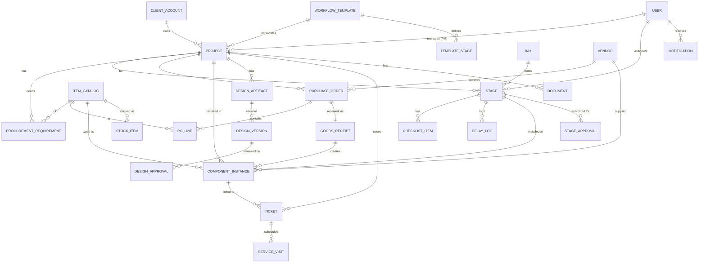

# Azimuth BuildTrack — Data Model (v1)

Derived directly from the 8-role UI. This defines **what data the system stores**, **how entities relate**, and **which role touches what**. It's the backbone for the API (next step) and the actual build.

**Type conventions:** `uuid` · `string` · `text` · `int` · `decimal` · `date` · `datetime` · `bool` · `enum(...)` · `FK→Entity` (foreign key) · `file` (stored doc/image URL).

---

## 1. Entity relationship diagram

---

## 2. Identity & Access

### USER
| Field | Type | Notes |
|---|---|---|
| id | uuid | PK |
| full_name | string | |
| email | string | login |
| phone | string | |
| role | enum(admin, pm, procurement, workshop, store, design, service, client) | drives which UI opens |
| avatar_color | string | UI accent per role |
| status | enum(active, invited, disabled) | |
| created_by | FK→User | the Admin who created it |
| created_at | datetime | |

> Only `admin` can create users and set `role`. This is the "Add Member" screen.

### CLIENT_ACCOUNT
| Field | Type | Notes |
|---|---|---|
| id | uuid | PK |
| business_name | string | e.g. "Ramesh Traders" |
| contact_user_id | FK→User | the client login (role=client) |
| phone / email | string | |

---

## 3. Projects & Build

### WORKFLOW_TEMPLATE
| Field | Type | Notes |
|---|---|---|
| id | uuid | PK |
| name | string | e.g. "Standard Food Truck", "Kiosk" |
| truck_type | string | |

### TEMPLATE_STAGE
| Field | Type | Notes |
|---|---|---|
| id | uuid | PK |
| template_id | FK→WorkflowTemplate | |
| name | string | e.g. "Electrical" |
| order | int | sequence |
| default_duration_days | int | used for auto-scheduling |
| depends_on | FK→TemplateStage | predecessor (dependency) |

### PROJECT
| Field | Type | Notes |
|---|---|---|
| id | uuid | PK |
| code | string | "AZ-118" |
| name | string | "Chai Point Truck" |
| client_account_id | FK→ClientAccount | |
| template_id | FK→WorkflowTemplate | |
| pm_id | FK→User | assigned Project Manager |
| status | enum(on_track, at_risk, delayed, delivered) | |
| progress_pct | int | derived from stages |
| current_stage_id | FK→Stage | |
| target_delivery_date | date | |
| actual_delivery_date | date | nullable |
| advance_received | bool | light payment gate |
| created_at | datetime | |

### STAGE
| Field | Type | Notes |
|---|---|---|
| id | uuid | PK |
| project_id | FK→Project | |
| template_stage_id | FK→TemplateStage | |
| name | string | |
| order | int | |
| planned_start / planned_end | date | auto-computed (backward schedule) |
| actual_start / actual_end | date | nullable |
| status | enum(todo, in_progress, done, rework) | |
| assignee_id | FK→User | workshop member |
| bay_id | FK→Bay | nullable |

### CHECKLIST_ITEM
| Field | Type | Notes |
|---|---|---|
| id | uuid | PK |
| stage_id | FK→Stage | |
| label | string | e.g. "Fit distribution board" |
| done | bool | |

### BAY
| Field | Type | Notes |
|---|---|---|
| id | uuid | PK |
| name | string | "Bay 3" |
| current_stage_id | FK→Stage | nullable (free if null) |

### DELAY_LOG
| Field | Type | Notes |
|---|---|---|
| id | uuid | PK |
| stage_id | FK→Stage | |
| reason_code | enum(procurement, design_approval, workshop_capacity, weather, client, quality, other) | |
| days_delayed | int | |
| note | text | |
| logged_by | FK→User | |
| created_at | datetime | powers "top delay reasons" analytics |

---

## 4. Procurement

### VENDOR
| Field | Type | Notes |
|---|---|---|
| id | uuid | PK |
| name | string | |
| category | string | Electronics, Steel… |
| avg_lead_time_days | int | |
| reliability_score | int | % on-time (auto-computed) |
| contact | string | |

### ITEM_CATALOG
| Field | Type | Notes |
|---|---|---|
| id | uuid | PK |
| name | string | "Samsung 42\" TV" |
| model | string | "UA42-XYZ" |
| category | string | |
| default_vendor_id | FK→Vendor | |
| lead_time_days | int | per-item lead time |
| buffer_days | int | safety buffer |
| serialized | bool | true=ComponentInstance, false=StockItem |
| unit | string | pcs, m, kg |
| low_stock_threshold | int | for bulk items |

### PROCUREMENT_REQUIREMENT  *(drives "To-Order" alerts — Hero #1)*
| Field | Type | Notes |
|---|---|---|
| id | uuid | PK |
| project_id | FK→Project | |
| item_catalog_id | FK→ItemCatalog | |
| qty | int | |
| needed_by_date | date | = stage install date |
| **order_by_date** | date | = needed_by − lead_time − buffer (computed) |
| status | enum(pending, ordered, received) | |
| po_id | FK→PurchaseOrder | nullable, once ordered |

### PURCHASE_ORDER
| Field | Type | Notes |
|---|---|---|
| id | uuid | PK |
| po_number | string | "PO-2041" |
| vendor_id | FK→Vendor | |
| project_id | FK→Project | |
| status | enum(ordered, dispatched, received, partial) | |
| order_date / expected_date | date | |
| created_by | FK→User | procurement |

### PO_LINE
| Field | Type | Notes |
|---|---|---|
| id | uuid | PK |
| po_id | FK→PurchaseOrder | |
| item_catalog_id | FK→ItemCatalog | |
| qty | int | |
| received_qty | int | for partial receipts |

### GOODS_RECEIPT (GRN)
| Field | Type | Notes |
|---|---|---|
| id | uuid | PK |
| po_id | FK→PurchaseOrder | |
| received_by | FK→User | store |
| received_at | datetime | |
| status | enum(complete, partial, issue) | |
| note | text | |

---

## 5. Inventory & Traceability

### COMPONENT_INSTANCE  *(the "digital twin" record — Hero #2)*
| Field | Type | Notes |
|---|---|---|
| id | uuid | PK |
| item_catalog_id | FK→ItemCatalog | model/type |
| serial_number | string | unique per physical unit |
| vendor_id | FK→Vendor | |
| grn_id | FK→GoodsReceipt | how it entered |
| bill_file | file | invoice/bill (**Store captures at intake**) |
| warranty_start / warranty_end | date | |
| status | enum(in_stock, installed, replaced, faulty) | |
| installed_in_project_id | FK→Project | nullable until installed |
| installed_stage_id | FK→Stage | nullable |
| installed_by | FK→User | workshop (via "Scan to install") |
| install_date | date | nullable |

> **Split:** Store creates this row + `bill_file` + warranty at receipt. Workshop's "Scan to install" only sets `installed_in_project_id`, `installed_stage_id`, `installed_by`, `install_date`, `status=installed`. No duplicate data entry.

> **Recall query:** `SELECT * FROM component_instance WHERE item_catalog_id = :model` → every truck (`installed_in_project_id`) with that part → notify all clients.

### STOCK_ITEM  *(bulk / non-serialized materials)*
| Field | Type | Notes |
|---|---|---|
| id | uuid | PK |
| item_catalog_id | FK→ItemCatalog | |
| quantity | decimal | |
| unit | string | |
| is_low | bool | qty < threshold (computed) |

---

## 6. Design

### DESIGN_ARTIFACT
| Field | Type | Notes |
|---|---|---|
| id | uuid | PK |
| project_id | FK→Project | |
| type | enum(layout, interior, exterior, branding) | |
| status | enum(draft, pending_approval, revision, approved) | |
| current_version_id | FK→DesignVersion | |
| created_by | FK→User | design |

### DESIGN_VERSION
| Field | Type | Notes |
|---|---|---|
| id | uuid | PK |
| artifact_id | FK→DesignArtifact | |
| version_no | int | v1, v2, v3 |
| file | file | render/PDF |
| change_note | text | "what changed" |
| created_at | datetime | |

### DESIGN_APPROVAL
| Field | Type | Notes |
|---|---|---|
| id | uuid | PK |
| version_id | FK→DesignVersion | |
| client_user_id | FK→User | |
| status | enum(pending, approved, changes_requested) | |
| feedback | text | client comment |
| decided_at | datetime | |

---

## 7. Service (post-delivery)

### TICKET
| Field | Type | Notes |
|---|---|---|
| id | uuid | PK |
| ticket_number | string | "T-241" |
| project_id | FK→Project | delivered truck |
| raised_by | FK→User | client |
| category | enum(equipment, electrical, cosmetic, other) | |
| description | text | |
| linked_component_id | FK→ComponentInstance | pulls warranty automatically |
| priority | enum(low, medium, high) | |
| sla_due | datetime | drives countdown pills |
| status | enum(open, in_progress, resolved, closed) | |
| assigned_to | FK→User | service |
| resolution_type | enum(warranty_replace, repair, remote_guide) | nullable |
| resolution_note | text | |
| created_at / resolved_at | datetime | |

### SERVICE_VISIT
| Field | Type | Notes |
|---|---|---|
| id | uuid | PK |
| ticket_id | FK→Ticket | |
| technician_id | FK→User | |
| scheduled_date | datetime | |
| status | enum(scheduled, done, cancelled) | |

---

## 8. Cross-cutting

### STAGE_APPROVAL *(workshop → PM)*
| Field | Type | Notes |
|---|---|---|
| id | uuid · stage_id FK→Stage · submitted_by FK→User(workshop) · approver_id FK→User(pm) · status enum(pending, approved, rejected) · photos (Attachment[]) · decided_at datetime |

### ATTACHMENT *(polymorphic — build photos, design files, bills, ticket photos)*
| Field | Type | Notes |
|---|---|---|
| id | uuid · owner_type enum(stage, ticket, component, design_version) · owner_id uuid · file file · caption string · uploaded_by FK→User · created_at datetime |

### DOCUMENT *(client-facing docs)*
| Field | Type | Notes |
|---|---|---|
| id | uuid · project_id FK→Project · type enum(contract, invoice, warranty_pack, handover_cert) · file file · available bool |

### NOTIFICATION
| Field | Type | Notes |
|---|---|---|
| id | uuid · user_id FK→User · type string · title string · body text · entity_ref (type+id) · read bool · created_at datetime |

### AUDIT_LOG
| Field | Type | Notes |
|---|---|---|
| id | uuid · actor_id FK→User · action string · entity_type/entity_id · timestamp datetime | who did what, when |

---

## 9. How the two hero features live in the model

**Hero #1 — never miss a lead time**
`PROCUREMENT_REQUIREMENT.order_by_date` = `needed_by_date − ItemCatalog.lead_time_days − buffer_days`, recomputed whenever a `STAGE` date shifts. A daily job flags requirements whose `order_by_date` is near/past and `status = pending` → procurement alerts + escalation.

**Hero #2 — full traceability + recall**
Every physical part = one `COMPONENT_INSTANCE` (serial + bill + warranty + which truck/stage). Recall = one query on `item_catalog_id`. A truck's full parts list = `WHERE installed_in_project_id = :project`.

---

## 10. Role → data access (permissions)

| Entity / area | Admin | PM | Procure | Workshop | Store | Design | Service | Client |
|---|---|---|---|---|---|---|---|---|
| Users & roles | RW | – | – | – | – | – | – | – |
| Projects (all) | RW | R (assigned) | R | R (own tasks) | R | R (assigned) | R (delivered) | R (own) |
| Stages / tasks | RW | RW | – | RW (own) | – | – | – | R (own) |
| Procurement / PO | R | R | RW | – | R | – | – | – |
| Vendors | R | – | RW | – | – | – | – | – |
| Component instances | R | R | – | R + install | RW | – | R | – |
| Stock | R | – | R | R | RW | – | – | – |
| Designs | R | R | – | – | – | RW | – | R (approve own) |
| Tickets | R | – | – | – | – | – | RW | RW (own) |
| Documents | RW | R | – | – | – | – | – | R (own) |
| Analytics | RW | R (own) | R (procure) | – | R (stock) | – | R (service) | – |

`RW` = read+write · `R` = read-only · `–` = no access. *(Costs & vendor data hidden from Workshop, Design, Client.)*

---

*Azimuth BuildTrack · Data Model · v1 · derived from role UIs*
