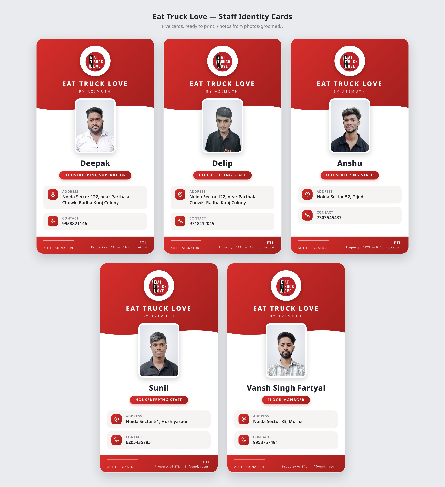

# ETL — Staff Identity Cards

Printable ID cards for **Eat Truck Love (ETL) by Azimuth** housekeeping staff.

- `etl-id-cards.html` — the ID cards (open in any browser; use **Ctrl/Cmd + P** to print or save as PDF).
- The ETL logo is recreated as inline SVG, so the file is fully self-contained (no external images needed).
- All five cards carry a photo. They load from `photos/groomed/`, falling back to the raw upload in `photos/` if a groomed version is missing.

## Design preview



## Staff on the cards

| Employee ID | Name | Designation | Address | Contact |
|---|---|---|---|---|
| ETL-HK-001 | Deepak | Housekeeping Supervisor | Noida Sector 122, near Parthala Chowk, Radha Kunj Colony | 9958821146 |
| ETL-HK-002 | Delip | Housekeeping Staff | Noida Sector 122, near Parthala Chowk, Radha Kunj Colony | 9718432045 |
| ETL-HK-003 | Anshu | Housekeeping Staff | Noida Sector 52, Gijod | 7303545437 |
| ETL-HK-004 | Sunil | Housekeeping Staff | Noida Sector 51, Hoshiyarpur | 6205435785 |
| ETL-MG-001 | Vansh Singh Fartyal | Floor Manager | Noida Sector 33, Morna | 9953757491 |

## Files

| Path | What it is |
|---|---|
| `etl-id-cards.html` | Source of truth for the card design and staff details |
| `id-cards/<slug>.png` | One high-res PNG per card (1020px wide, 3× scale) |
| `ETL-Staff-ID-Cards.pdf` | Print-ready PDF, all five cards, A4 |
| `preview/etl-id-cards-preview.png` | All five cards on one sheet |
| `photos/` | Raw photos as received |
| `photos/groomed/` | Cleaned-up photos used on the cards — see its [README](photos/groomed/README.md) |

## Rebuilding after a change

Edit `etl-id-cards.html` (staff details, design), then regenerate the PNGs, PDF and preview:

```bash
pip install playwright && playwright install chromium
python3 tools/render_cards.py
```

To re-groom the photos (background, framing, colour), see
[`photos/groomed/README.md`](photos/groomed/README.md) and `tools/groom_photos.py`.
