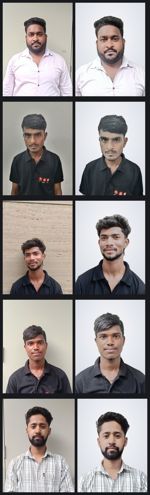
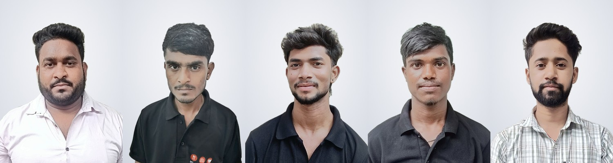

# Groomed staff photos

Cleaned-up versions of the raw shots in `photos/`. **These are the photos on the
ID cards.** The originals in `photos/` are kept untouched as the source.

| File | Source |
|---|---|
| `deepak.jpeg` | `photos/deepak.jpeg` |
| `delip.jpeg` | `photos/delip.jpeg` |
| `anshu.jpeg` | `photos/anshu.jpeg` |
| `sunil.jpeg` | `photos/sunil.jpeg` |
| `vansh.jpeg` | `photos/vansh.jpeg` |

All five are 900 × 1200 (3:4 portrait, 300 dpi) with matching framing.

## Side-by-side review



The five finished cards' photos together, to check they look like one consistent set:



Per-person sheets: [deepak](_review/deepak-before-after.jpg) ·
[delip](_review/delip-before-after.jpg) · [anshu](_review/anshu-before-after.jpg) ·
[sunil](_review/sunil-before-after.jpg) · [vansh](_review/vansh-before-after.jpg)

## What was changed

- **Background replaced** with an even studio grey-white gradient. This is what
  removes the rough concrete wall (Anshu), the greenish wall and dark door edge
  (Sunil), the cabinet seams (Vansh) and the pencil scribble on the office wall
  (Deepak).
- **Head levelled** using the eye line — small rotations only, up to 7°.
  Anshu −6.1°, Delip −3.9°, Sunil −3.1°, Vansh +0.9°.
- **Framing standardised.** Face centred, head exactly 50% of frame height on
  every card, matching headroom, so the five cards look like a set.
- **Colour and light.** White balance, then exposure metered off the face:
  Delip, Anshu and Sunil were noticeably underexposed and got a real lift.
  Plus gentle local contrast and a small saturation nudge.
- **Shine reduced** on foreheads and noses (most visible on Deepak).
- **Light retouch** — skin tone and camera noise evened out on skin areas only,
  with eyes, brows, lips, hair and clothing edges protected.

## What was deliberately not changed

No face reshaping, no slimming, no skin whitening, no feature editing. An ID
photo has to stay a true likeness of the person, so the retouch is limited to
lighting, colour, background and framing.

Dark tones are held to within ~10% of the original brightness on purpose. A
plain exposure lift brightens hair along with skin, and lifted black hair reads
as grey hair — which would make people look older than they are on their own ID.
Measured hair/uniform vs face brightness, original → groomed:

| Person | Hair & uniform | Face |
|---|---|---|
| Deepak | 0.175 → 0.183 | 0.552 → 0.592 |
| Delip | 0.172 → 0.191 | 0.421 → 0.549 |
| Anshu | 0.137 → 0.150 | 0.443 → 0.544 |
| Sunil | 0.179 → 0.194 | 0.446 → 0.520 |
| Vansh | 0.128 → 0.135 | 0.498 → 0.569 |

One thing worth a look: Delip's and Sunil's hair still reads slightly grey. That
is genuinely how it appears in their raw photos (flat overhead light on textured
hair), so it was left alone rather than darkened artificially. Easy to change if
you'd prefer it darker — just say so.

## Regenerating

```bash
pip install pillow numpy opencv-python-headless "rembg[cpu]" onnxruntime
python3 tools/groom_photos.py --contact-sheet   # -> this folder
python3 tools/render_cards.py                   # -> id-cards/, PDF, preview
```

Models download on first run (~176 MB human-segmentation, ~230 KB face detector).
See `tools/groom_photos.py` for the full pipeline.

Useful knobs at the top of that script: `HEAD_RATIO` (head size as a share of
frame height, currently 0.50), `TOP_GAP` (headroom, 0.14), `MAX_ROLL_DEG`
(levelling limit, 7°) and `BG_CENTER` / `BG_EDGE` for the backdrop colour.

The card's photo box is 3:4 to match these files exactly, so `object-fit: cover`
has nothing left to crop and the cards show the framing as it appears here.
